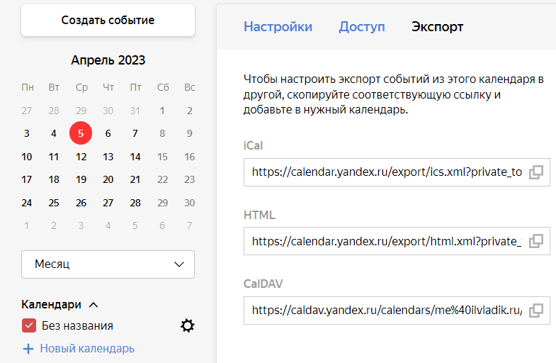
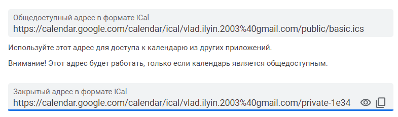

# Reminder Bot

## Описание

Бот предназначен для работы с календарями.
С его помощью можно получать уведомления о событиях из таких сервисов как Яндекс Календарь, Google Календарь прямо в Telegram чате.
Пользователь может и добавлять бота в другие чаты и взаимодействовать с ним лично, изменять список календарей, из которых он хочет получать уведомления, а также выбирать часовой пояс.

Протестировать можно [тут](https://t.me/event_remindbot).

### Команды для взаимодействия с ботом

    /start - Начало взаимодействия с ботом
    /help - Информация о боте, а также текущих настройках
    /add %ссылка% - Добавление календаря в список
    /del %ссылка% - Удаление календаря из списка
    /list - Вывод списка календарей, связанных с текущим чатом
    /offset - Установка часового пояса

## Ссылки на календари

Ссылку на календарь нельзя просто копировать из адресной строки браузера, она не будет работать.

Где её можно найти зависит от сервиса, который вы используете.

В Яндекс Календаре данная ссылка находится в Настройки календаря->Экспорт->iCal

В Google Календаре данная ссылка находится в Настройки календаря->Интеграция календаря->iCal

